# ProgettoGEP
# Cognome
Silva

# Nome
Lorenzo

# Titolo 
HoopLink

# Descrizione
Un'applicazione che permette agli utenti di creare o iscriversi a eventi sportivi di basket. Gli utenti possono registrarsi inserendo tutte le informazioni personali, comprese le certificazioni della società sportiva di appartenenza. In questo modo, altri utenti  possono visionare i profili e reclutarli per partecipare agli eventi.

# Problema
Risolve il problema del reclutamento di giocatori per eventi, sia amatoriali che competitivi, offrendo inoltre la possibilità di essere notati da enti o organizzazioni di livello superiore.

# Target
Giocatori under e senior, con la possibilità di appartenere o meno a una squadra affiliata alla FIBA 

# Competitors
CourtMapping,Revocruit,Basketball Finders,RecruitMe Sports

# Tagline
Organizza, gioca, connettiti

# Tecnologie
- Frontend: Flutter (sviluppo mobile multipiattaforma, Android/iOS).

- Backend: Node.js + Express (gestione utenti, tornei e messaggi).

- Database: PostgreSQL (archiviazione dati).

- Autenticazione: Firebase Authentication (login sicuro).

- Chat e notifiche: Socket.IO (comunicazione in tempo reale).

- Storage: Cloudinary (immagini e certificazioni).

- Hosting: Render / Firebase Hosting.

# Tabella di benchmarking

# Requisiti

Funzionali
- Registrazione e login utente - Creazione di tornei di basket - Iscrizione ai tornei - Gestione profilo personale (dati giocatore) - Chat tra utenti - Visualizzazione tornei e partecipanti
Non funzionali
- Interfaccia semplice e intuitiva - Sicurezza dei dati - Tempi di risposta rapidi - Compatibilità con vari dispositivi - Database affidabile - Possibilità di aggiungere nuove funzioni
Di dominio
- Numero minimo/massimo di squadre per torneo - Regole base del basket - Ogni utente può appartenere a una sola squadra per torneo - Calendario o tabellone partite - Dati giocatore (ruolo, numero, altezza, ecc.)

# Diagramma UML Use Case 

http://yuml.me/cisti/GEP1.svg

# Timestamp JWT
1758872939

# Lovable web page
https://hooplink-connect.lovable.app

# Slide 1 – Introduzione

HoopLink – Organizza, gioca, connettiti

HoopLink è una piattaforma mobile pensata per semplificare l’organizzazione di eventi di basket e mettere in contatto giocatori, squadre e organizzatori.

Progetto GEP – Lorenzo Silva

App per eventi e reclutamento nel basket

Obiettivo: creare una community sportiva digitale

# Slide 2 – Il problema

Nel basket amatoriale e locale l’organizzazione è spesso poco efficiente e frammentata.

Eventi gestiti tramite chat o social

Difficoltà nel trovare giocatori disponibili

Scarsa visibilità per gli atleti

Difficoltà per squadre e organizzatori nel reclutamento

# Slide 3 – La soluzione

HoopLink riunisce in un’unica app tutti gli strumenti necessari per organizzare e partecipare agli eventi.

Creazione e gestione di partite e tornei

Iscrizione rapida come giocatore o squadra

Profili sportivi dettagliati

Chat e comunicazione in tempo reale

# Slide 4 – Mercato

Il basket è uno degli sport più diffusi e il numero di eventi amatoriali è in continua crescita.

Migliaia di tornei e partite ogni anno

Crescita del settore sport-tech e delle app di community

Target iniziale: giocatori e organizzatori locali

Possibilità di espansione nazionale

# Slide 5 – Modello di business

Il progetto segue un modello freemium, per favorire la crescita degli utenti.

Versione gratuita:

Profilo giocatore

Partecipazione agli eventi

Chat

Versione Premium:

Maggiore visibilità del profilo

Promozione eventi

Strumenti per società e organizzatori

# Slide 6 – Tecnologia

L’app è progettata con tecnologie moderne, sicure e scalabili.

Flutter → app Android e iOS

Node.js + Express → backend

PostgreSQL → gestione dati

Firebase Authentication → sicurezza

Socket.IO → chat e notifiche in tempo reale

Cloudinary → immagini e certificazioni

# Slide 7 – Competizione

Esistono piattaforme simili, ma spesso non specifiche o con funzionalità limitate.

Principali competitor:

CourtMapping

RecruitMe Sports

Basketball Finders

Differenza: HoopLink unisce eventi, profili e comunicazione in un’unica piattaforma dedicata solo al basket.

# Slide 8 – Perché HoopLink

Il valore principale è la semplicità e la specializzazione.

Focus esclusivo sul basket

Profili completi e verificabili

Organizzazione eventi rapida

Connessione diretta tra giocatori, squadre e società

# Slide 9 – Acquisizione utenti

La crescita iniziale sarà focalizzata sulla community locale.

Social media (Instagram, TikTok)

Collaborazioni con palestre e tornei

Community e gruppi sportivi

Passaparola tra giocatori

# Slide 10 – Investimento e obiettivi

Per completare il progetto è previsto un investimento iniziale di 50.000€.

L’investimento servirà per:

Sviluppo e completamento dell’MVP

Pubblicazione e infrastruttura cloud

Attività di lancio e promozione

Obiettivo: validare il prodotto e iniziare la crescita degli utenti.

# Elevator pitch

Ciao, sono Lorenzo Silva, fondatore di HoopLink.
Sapete che uno dei principali problemi nel basket amatoriale è la difficoltà di trovare giocatori, organizzare partite e dare visibilità agli atleti? Oggi la maggior parte degli eventi viene gestita tramite chat o social, in modo poco efficiente.

Abbiamo creato HoopLink per risolvere questo problema.

HoopLink è una piattaforma mobile che permette ai giocatori di creare e partecipare a eventi, mostrare il proprio profilo sportivo e comunicare in tempo reale con squadre e organizzatori. A differenza delle soluzioni generiche, HoopLink è progettata esclusivamente per il basket e integra organizzazione, reclutamento e community in un’unica applicazione.

L’infrastruttura tecnologica è già progettata, con app multipiattaforma, backend scalabile, autenticazione sicura e sistema di notifiche e chat in tempo reale. Il modello di business è freemium, con funzionalità premium per maggiore visibilità e strumenti dedicati a società e organizzatori.

Oggi cerchiamo un investimento iniziale di 50.000€ per completare lo sviluppo dell’MVP, avviare il lancio sul mercato e avviare le prime attività di promozione.

Il nostro obiettivo è diventare il punto di riferimento digitale per la community del basket.
Siete pronti a connettere con noi il futuro del basket?

# HoopLink WBS

```mermaid

graph TD
    A["HoopLink<br/>(Sviluppo App Basket)"] --> B["Pianificazione & Analisi"]
    A --> C["Design UI/UX"]
    A --> D["Sviluppo Frontend (Flutter)"]
    A --> E["Sviluppo Backend (Node.js)"]
    A --> F["Database & Storage"]
    A --> G["Funzionalità Real-Time"]
    A --> H["Testing & Sicurezza"]
    A --> I["Deploy & Lancio"]
    A --> J["Supporto & Manutenzione"]

    %% Pianificazione
    B --> B1["Analisi requisiti funzionali"]
    B --> B2["Analisi competitor"]
    B --> B3["Definizione MVP"]
    B --> B4["Pianificazione sviluppo"]

    %% Design
    C --> C1["Wireframe schermate principali"]
    C --> C2["Prototipo navigazione app"]
    C --> C3["Test usabilità"]

    %% Frontend
    D --> D1["Schermata login/registrazione"]
    D --> D2["Dashboard eventi"]
    D --> D3["Creazione e iscrizione tornei"]
    D --> D4["Profilo giocatore"]
    D --> D5["Gestione squadre"]

    %% Backend
    E --> E1["API REST utenti"]
    E --> E2["API tornei ed eventi"]
    E --> E3["Gestione autenticazione Firebase"]
    E --> E4["Gestione ruoli e permessi"]

    %% Database
    F --> F1["Schema PostgreSQL"]
    F --> F2["Gestione dati giocatori"]
    F --> F3["Upload immagini e certificazioni (Cloudinary)"]

    %% Real-time
    G --> G1["Chat utenti (Socket.IO)"]
    G --> G2["Notifiche eventi"]
    G --> G3["Aggiornamenti partecipanti in tempo reale"]

    %% Testing
    H --> H1["Test funzionali"]
    H --> H2["Bug fixing"]
    H --> H3["Test performance e sicurezza"]

    %% Deploy
    I --> I1["Deploy backend su Render"]
    I --> I2["Build app Android/iOS"]
    I --> I3["Pubblicazione e documentazione"]

    %% Manutenzione
    J --> J1["Monitoraggio sistema"]
    J --> J2["Aggiornamenti funzionalità"]
    J --> J3["Supporto utenti"]
```

