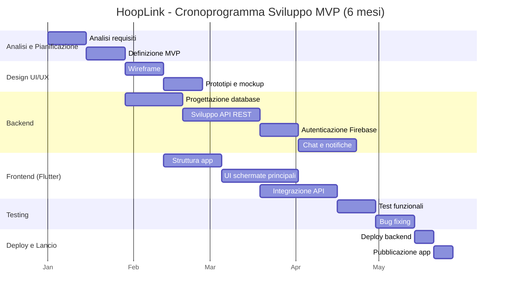

# HoopLink
Autore: Silva Lorenzo

# Descrizione
Un'applicazione che permette agli utenti di creare o iscriversi a eventi sportivi di basket. Gli utenti possono registrarsi inserendo tutte le informazioni personali, comprese le certificazioni della società sportiva di appartenenza. In questo modo, altri utenti  possono visionare i profili e reclutarli per partecipare agli eventi.

# Problema
Risolve il problema del reclutamento di giocatori per eventi, sia amatoriali che competitivi, offrendo inoltre la possibilità di essere notati da enti o organizzazioni di livello superiore.

# Target
Giocatori under e senior, con la possibilità di appartenere o meno a una squadra affiliata alla FIBA 

# Competitors
- CourtMapping
- Revocruit
- Basketball Finders
- RecruitMe Sports

# Tabella comparativa   
| Caratteristica              | HoopLink                        | CourtMapping          | Revocruit           | Basketball Finders  | RecruitMe Sports      |
| --------------------------- | ------------------------------- | --------------------- | ------------------- | ------------------- | --------------------- |
| 🎯 Focus principale         | Eventi + community + recruiting | Networking e scouting | Recruiting sportivo | Placement giocatori | Recruiting accademico |
| 🏀 Specifico per basket     | ✅ Sì                            | ✅ Sì                  | ❌ Multi-sport       | ✅ Sì                | ❌ Multi-sport         |
| 📅 Creazione eventi         | ✅ Sì                            | ⚠️ Limitato           | ❌ No                | ❌ No                | ❌ No                  |
| 👥 Iscrizione a partite     | ✅ Sì                            | ❌ No                  | ❌ No                | ❌ No                | ❌ No                  |
| 👤 Profilo giocatore        | ✅ Completo                      | ✅ Completo            | ✅ Completo          | ⚠️ Base             | ✅ Completo            |
| 💬 Chat tra utenti          | ✅ Sì                            | ⚠️ Limitata           | ❌ No                | ❌ No                | ❌ No                  |
| 🌍 Community locale         | ✅ Sì                            | ❌ No                  | ❌ No                | ❌ No                | ❌ No                  |
| 🎥 Video / highlight        | ⚠️ Possibile                    | ✅ Sì                  | ✅ Sì                | ✅ Sì                | ✅ Sì                  |
| 🧑‍🏫 Connessione con coach | ⚠️ Sì                           | ✅ Sì                  | ✅ Sì                | ✅ Sì                | ✅ Sì                  |
| 💸 Prezzo medio             | 🟢 Basso (3–5€/mese)            | 🔴 Alto (~40$/mese)   | 🔴 Medio/Alto       | 🔴 Alto             | 🔴 Alto               |
| 🚀 Facilità d’uso           | 🟢 Alta                         | ⚠️ Media              | ⚠️ Media            | ⚠️ Media            | ⚠️ Media              |

# Tagline
Organizza, gioca, connettiti

# Tecnologie
- Frontend: Flutter (sviluppo mobile multipiattaforma, Android/iOS).

- Backend: Node.js + Express (gestione utenti, tornei e messaggi).

- Database: PostgreSQL (archiviazione dati).

- Autenticazione: Firebase Authentication (login sicuro).

- Chat e notifiche: Socket.IO (comunicazione in tempo reale).

- Storage: Cloudinary (immagini e certificazioni).

- Hosting: Render / Firebase Hosting.

# Requisiti

Funzionali
- Registrazione e login utente - Creazione di tornei di basket - Iscrizione ai tornei - Gestione profilo personale (dati giocatore) - Chat tra utenti - Visualizzazione tornei e partecipanti

User story
  
| Attore        | Requisito / Azione                       | Beneficio                                                  |
| ------------- | ---------------------------------------- | ---------------------------------------------------------- |
| Utente        | Registrarsi e creare un profilo sportivo | Mostrare le proprie informazioni e partecipare agli eventi |
| Giocatore     | Cercare eventi e tornei                  | Trovare facilmente partite a cui partecipare               |
| Giocatore     | Iscriversi a eventi                      | Giocare e prendere parte alle partite                      |
| Organizzatore | Creare eventi o tornei                   | Trovare giocatori e organizzare partite                    |
| Utente        | Visualizzare profili di altri giocatori  | Scegliere con chi giocare o chi invitare                   |
| Utente        | Utilizzare la chat                       | Comunicare e organizzarsi con altri giocatori              |
| Giocatore     | Rendere visibile il proprio profilo      | Essere notato da squadre o organizzatori                   |
| Organizzatore | Gestire partecipanti e squadre           | Organizzare eventi in modo semplice ed efficace            |
| Utente        | Ricevere notifiche sugli eventi          | Restare aggiornato su inviti e modifiche                   |
| Giocatore     | Caricare certificazioni e dati sportivi  | Aumentare affidabilità e credibilità                       |

Non funzionali
- Interfaccia semplice e intuitiva - Sicurezza dei dati - Tempi di risposta rapidi - Compatibilità con vari dispositivi - Database affidabile - Possibilità di aggiungere nuove funzioni

Di dominio
- Numero minimo/massimo di squadre per torneo - Regole base del basket - Ogni utente può appartenere a una sola squadra per torneo - Calendario o tabellone partite - Dati giocatore (ruolo, numero, altezza, ecc.)

# Diagramma UML Use Case 

http://yuml.me/cisti/GEP1.svg

# Timestamp JWT
1758872939

# Lovable web page
https://hooplink-connect.lovable.app

# Elevator pitch

Ciao, sono Lorenzo Silva, fondatore di HoopLink.
Sapete che uno dei principali problemi nel basket amatoriale è la difficoltà di trovare giocatori, organizzare partite e dare visibilità agli atleti? Oggi la maggior parte degli eventi viene gestita tramite chat o social, in modo poco efficiente.

Abbiamo creato HoopLink per risolvere questo problema.

HoopLink è una piattaforma mobile che permette ai giocatori di creare e partecipare a eventi, mostrare il proprio profilo sportivo e comunicare in tempo reale con squadre e organizzatori. A differenza delle soluzioni generiche, HoopLink è progettata esclusivamente per il basket e integra organizzazione, reclutamento e community in un’unica applicazione.

L’infrastruttura tecnologica è già progettata, con app multipiattaforma, backend scalabile, autenticazione sicura e sistema di notifiche e chat in tempo reale. Il modello di business è freemium, con funzionalità premium per maggiore visibilità e strumenti dedicati a società e organizzatori.

Oggi cerchiamo un investimento iniziale di 50.000€ per completare lo sviluppo dell’MVP, avviare il lancio sul mercato e avviare le prime attività di promozione.

Il nostro obiettivo è diventare il punto di riferimento digitale per la community del basket.
Siete pronti a connettere con noi il futuro del basket?

# HoopLink WBS

```mermaid

graph TD
    A["HoopLink<br/>(Sviluppo App Basket)"] --> B["Pianificazione & Analisi"]
    A --> C["Design UI/UX"]
    A --> D["Sviluppo Frontend (Flutter)"]
    A --> E["Sviluppo Backend (Node.js)"]
    A --> F["Database & Storage"]
    A --> G["Funzionalità Real-Time"]
    A --> H["Testing & Sicurezza"]
    A --> I["Deploy & Lancio"]
    A --> J["Supporto & Manutenzione"]

    %% Pianificazione
    B --> B1["Analisi requisiti funzionali"]
    B --> B2["Analisi competitor"]
    B --> B3["Definizione MVP"]
    B --> B4["Pianificazione sviluppo"]

    %% Design
    C --> C1["Wireframe schermate principali"]
    C --> C2["Prototipo navigazione app"]
    C --> C3["Test usabilità"]

    %% Frontend
    D --> D1["Schermata login/registrazione"]
    D --> D2["Dashboard eventi"]
    D --> D3["Creazione e iscrizione tornei"]
    D --> D4["Profilo giocatore"]
    D --> D5["Gestione squadre"]

    %% Backend
    E --> E1["API REST utenti"]
    E --> E2["API tornei ed eventi"]
    E --> E3["Gestione autenticazione Firebase"]
    E --> E4["Gestione ruoli e permessi"]

    %% Database
    F --> F1["Schema PostgreSQL"]
    F --> F2["Gestione dati giocatori"]
    F --> F3["Upload immagini e certificazioni (Cloudinary)"]

    %% Real-time
    G --> G1["Chat utenti (Socket.IO)"]
    G --> G2["Notifiche eventi"]
    G --> G3["Aggiornamenti partecipanti in tempo reale"]

    %% Testing
    H --> H1["Test funzionali"]
    H --> H2["Bug fixing"]
    H --> H3["Test performance e sicurezza"]

    %% Deploy
    I --> I1["Deploy backend su Render"]
    I --> I2["Build app Android/iOS"]
    I --> I3["Pubblicazione e documentazione"]

    %% Manutenzione
    J --> J1["Monitoraggio sistema"]
    J --> J2["Aggiornamenti funzionalità"]
    J --> J3["Supporto utenti"]
```
# HoopLink Cronoprogramma

```mermaid
gantt
    title HoopLink - Cronoprogramma Sviluppo MVP (6 mesi)
    dateFormat  YYYY-MM-DD
    axisFormat  %b

    section Analisi e Pianificazione
    Analisi requisiti           :a1, 2026-01-01, 2w
    Definizione MVP             :a2, after a1, 2w

    section Design UI/UX
    Wireframe                   :b1, after a2, 2w
    Prototipi e mockup          :b2, after b1, 2w

    section Backend
    Progettazione database      :c1, after a2, 3w
    Sviluppo API REST           :c2, after c1, 4w
    Autenticazione Firebase     :c3, after c2, 2w
    Chat e notifiche            :c4, after c3, 3w

    section Frontend (Flutter)
    Struttura app               :d1, after b1, 3w
    UI schermate principali     :d2, after d1, 4w
    Integrazione API            :d3, after c2, 4w

    section Testing
    Test funzionali             :e1, after d3, 2w
    Bug fixing                  :e2, after e1, 2w

    section Deploy e Lancio
    Deploy backend              :f1, after e2, 1w
    Pubblicazione app           :f2, after f1, 1w
```
